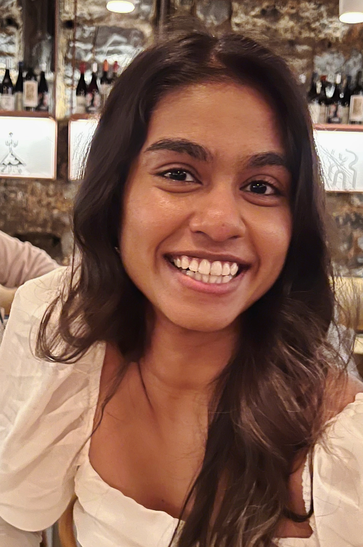
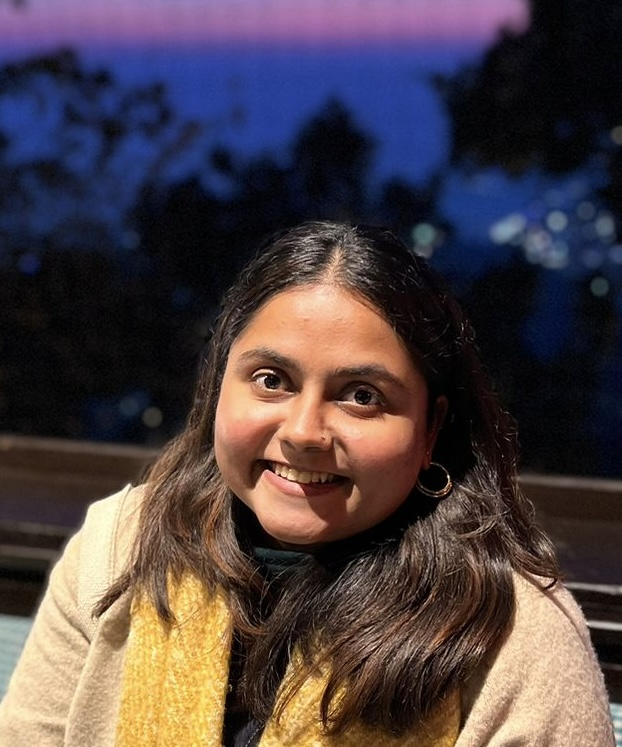
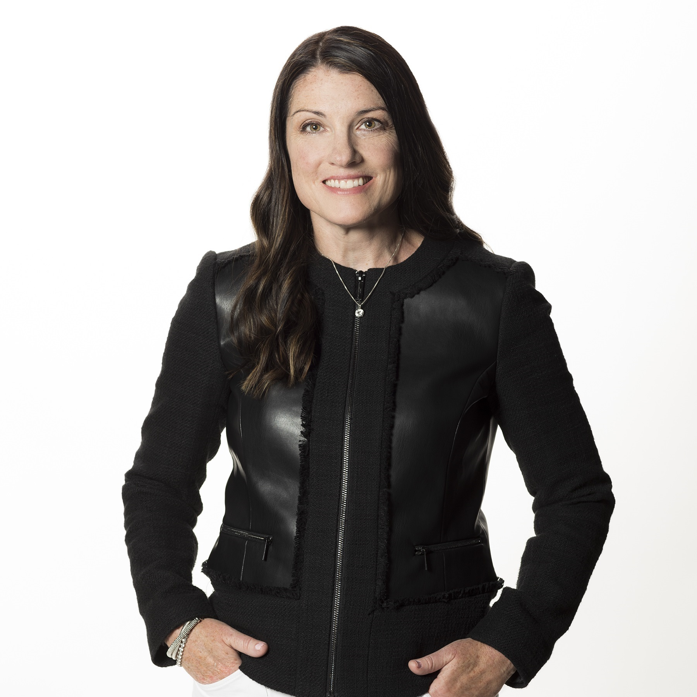

## Objective 
Create an html file for a website for our community, Women in Manufacturing (WiM) @ Microsoft.
The content should be simple and elegant. 
Implement the below and format the content to match the Theme while making sure it is elegant and compelling. 

## Theme and color scheme 
This file contains our log: .png)
This file has our color scheme: 

## Sections to Include

- A new initiative 'Women in Manufacturing Community Group'
    Should be able to click on this and it take you to this link: https://forms.office.com/Pages/ResponsePage.aspx?id=v4j5cvGGr0GRqy180BHbRx-fDgf-IQpIpmxv8FRztiVURFdKVkc2NzRQNDVUS0o0R1JRMlpDUThCTi4u
    The link should be title 'Join Our Community Today'

- Our Leadership
    Below are the images, name, and roles:
    Core Team:
    : Anna Assama, President
    : Carla Ravizza, Chief of Staff
    : Vennessa Hopson, Business Lead
    : Oshani Da Silva, Marketing 
    : Anna Lena, Content Lead
    : Aparmita Sharma, Events Lead
    : Alejandra McGranaghan, Event Manager
    : Arshiya Vij, Creative Director
    : Felice Miller, 
    : Martha Reyna-Medina, Partnership/Scholarship Lead
    Advisory Board:
    : William Heurdier, Board Member
    .jpeg): Hamlet D'Arcy, Board Member
    Our Sponsors:
    : Dominik Wee, CVP Engineering
    : Kathleen Mitford, CVP Global Industry Marketing
    : Dayan Rodriguez, CVP Manufacturing & Mobility

    Make sure all images are the same size displayed. Have the title of each section as a banner diving each section. 

- Sessions and Events
    This will have a list of our Upcoming Events. 
    Have this section as a card. When you clicn the card, it takes you to apage with the following content:
    - Event: WiM @ Microsoft: Kick-Off & Executive Panel Discussion 
        Date: June 10, 2025
        Recording: 
    - Event: WiM @ Microsoft: Empowering Career Growth
        Date: September 24, 2025
        Recording: %20Empowering%20Career%20Growth-20250924_164540UTC-Meeting%20Recording%20(1).mp4)
    - Event: WiM @ Microsoft: Empowering the Future of Business
        Date: October 9, 2025
        Recording:%20Women%20Empowering%20the%20Future%20of%20Business-20251009_205711UTC-Meeting%20Recording.mp4)

    For the above page, Make sure they are even in size (each event Section), the information is shown in a compeeling what, adding icons.

- Past Events and Sessions
    The sectin will take you to page where past yoi can find recordings and content from past sessions.
    Will upload specific information later

## Design
Have the top of the page be a banner with our name and logo
Headers and background should follow our color theme.
Each sectio should be a rectangle (equally sized). The user can click on to get to the content.

